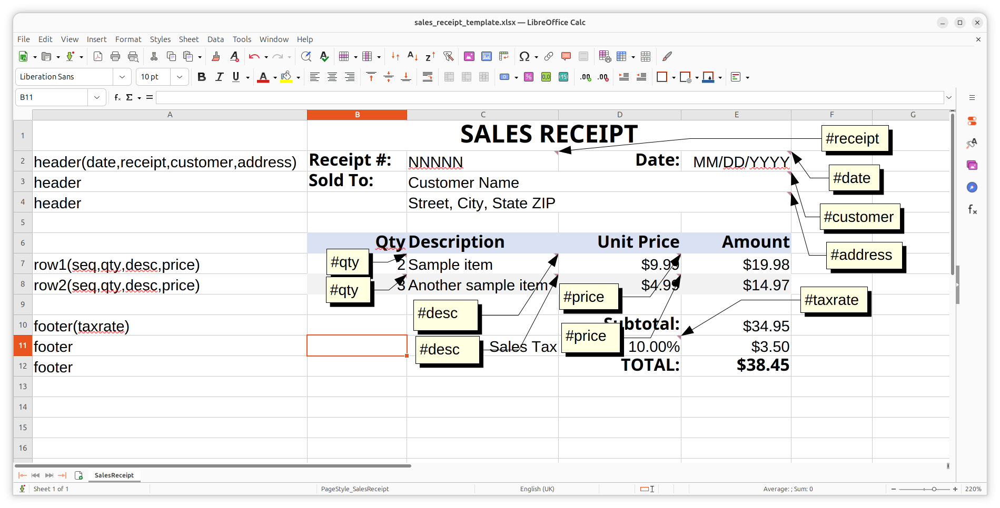
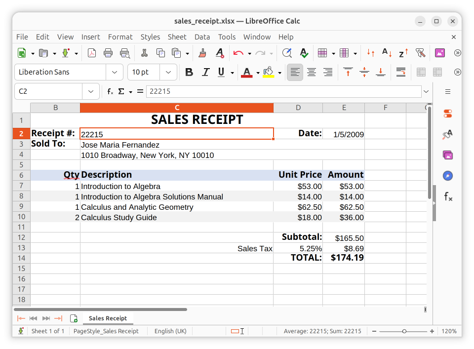

# xforme

**A blazing-fast Rust engine that streams your data through ordinary Excel
templates to mass-produce richly-formatted `.xlsx` spreadsheets — formatting and
formulas intact.**

xforme is the Rust migration of [*templateIt*](https://templateit.sourceforge.net/)
— the 2009 Java project by the same author — and its canonical
[Sales Receipt](https://templateit.sourceforge.net/SalesReceipt.html) example.

The idea: **design the document once as an ordinary Excel workbook**, then stream
a data file (tab-delimited, JSON, or YAML) through it. The engine **edits the
template sheet in place** — filling parameters, growing the repeating rows, and
renaming the sheet — so it preserves *everything* in the workbook: styles, number
formats, merges, formulas, **conditional formatting, images, charts, data
validations, print setup**. The original templateIt used Apache POI for this;
xforme uses [`umya-spreadsheet`](https://crates.io/crates/umya-spreadsheet).

`.xlsx` is the product. **PDF, when you need it, is just a downstream conversion**
of the produced spreadsheet (Excel "Save as PDF", or a headless LibreOffice — the
CLI does the latter for you when LibreOffice is installed).

## Example

The **template** you design in Excel/LibreOffice — control labels in column A,
**placeholder sample values** (`NNNNN`, `MM/DD/YYYY`, `Customer Name`,
`Sample item`, …), live formulas, and the callouts showing each cell's `#name`
comment that binds it to a data field (`templates/sales_receipt_template.xlsx`):



Fed this tab-delimited **data file** (`data/sales_receipt.txt`):

```text
#sheet	SalesReceipt	Sales Receipt
header	1/5/2009	22215	Jose Maria Fernandez	1010 Broadway, New York, NY 10010
row1	1	1	Introduction to Algebra	53.0
row2	2	1	Introduction to Algebra Solutions Manual	14.0
row1	3	1	Calculus and Analytic Geometry	62.5
row2	4	2	Calculus Study Guide	18.0
footer	.0525
##end
```

xforme renders the **report** — the placeholder samples replaced by the actual
data (`22215`, `Jose Maria Fernandez`, …), column A and the parameter comments
gone, the repeating rows expanded, and the formulas evaluated:



## Pipeline

```text
data file ──[data::parse]──▶ Sheet ──┐
                                     ├─[xlsx_template::render]──▶ .xlsx report
template.xlsx ───────────────────────┘
```

* **`data`** — parses the tab-delimited stream format (`#sheet` … records … `##end`).
* **`xlsx_template`** — edits the designer's `.xlsx` sheet in place: resizes the
  detail band (row insert/remove, which grows spanning ranges), fills params,
  and renames the sheet; preserves styles, number formats, merges, formulas,
  conditional formatting, images, charts (via `umya-spreadsheet`).
* **`demo_template`** — builds the bundled sample Sales Receipt template.

## Run it

**The `xforme` binary is generic** — point it at any `.xlsx` template and a data
file:

```sh
cargo run -- --template TEMPLATE.xlsx --data DATA.txt [--out PREFIX] [--no-pdf]

# e.g. with the bundled sample template + data (.txt, .json, or .yaml all work):
cargo run -- --template templates/sales_receipt_template.xlsx --data data/sales_receipt.txt
cargo run -- --template templates/sales_receipt_template.xlsx --data data/sales_receipt.yaml
```

It writes `PREFIX.xlsx` (template tab removed, formulas live) and, unless
`--no-pdf`, also `PREFIX.pdf` via a headless LibreOffice when one is available.
`PREFIX` defaults to the data file's stem.

**The demo example is self-contained** — the Sales Receipt template and data are
embedded at compile time with `include_bytes!` / `include_str!`, so it needs no
external files (this is the pattern to copy for shipping a fixed report inside
your own binary, see [`examples/sales_receipt.rs`](examples/sales_receipt.rs)):

```sh
cargo run --example sales_receipt            # -> sales_receipt.xlsx
cargo run --example sales_receipt out.xlsx   # choose the output path
```

The bundled template is the committed asset
`templates/sales_receipt_template.xlsx` — edit it in Excel to change the design,
or edit `src/demo_template.rs` and regenerate it:

```sh
cargo run --bin make_sample_template  # regenerates templates/sales_receipt_template.xlsx
cargo test                            # parser, parameter resolution, formula-shift, e2e
```

## Designing a template

A template is an **ordinary Excel/LibreOffice workbook** — you design it visually,
the way you want the output to look, then add a few lightweight annotations that
tell xforme what to fill and what to repeat. No Rust required to make a new
document type.

**1. Lay out the document.** Type the labels, choose fonts, fills, borders,
alignment, number formats, merge cells — exactly as a finished sample. Put
**real sample values** in the cells that will carry data (a real date, quantity,
price). This keeps the file a normal, openable workbook and lets formulas compute
and number formats preview while you design.

**2. Label each row's role in column A** (the control column — it's hidden in the
output):
- `header` — emitted once, filled from the `header` data record;
- `footer` — emitted once, filled from the `footer` record;
- a *detail* label like `row1` / `row2` — a repeating row; consecutive detail
  rows form the **detail band**, emitted once per matching data record (alternate
  `row1`/`row2` for banded striping);
- leave it **blank** for a static row (title, column headers, spacers).

**3. Declare each band's field names once**, in the label on the band's first
row: `header(date,receipt,customer,address)`. This maps your `#name` parameters
to the positional data fields. Bare `header` on the band's other rows just
attaches them.

**4. Mark the data cells with a comment.** On each cell that should be filled
from data, add a cell **comment** containing `#name` (a name from that row's
schema) — or `#N` for the N-th field. Leave the sample value in the cell. xforme
swaps in the data at render time and strips the comment. (Excel paints a red
triangle on commented cells, so your parameters are visible at a glance.)

**5. Write formulas natively.** Use ordinary Excel formulas over real cells
(`=B7*D7`). When a row is replicated downward, xforme shifts *relative* references
automatically (`=B7*D7` → `=B12*D12`) and leaves `$`-anchored ones fixed. For a
**total over the variable-length detail band**, use mixed anchoring —
`=SUM(E$7:E8)` — so the anchored start stays put while the relative end grows to
cover every rendered detail row.

**6. Save as `.xlsx`.** That's the template. The output tab is named by the data
stream's `#sheet` title; column A and the comments are gone, and the template
sheet itself is removed.

### Worked example

The bundled `templates/sales_receipt_template.xlsx` is laid out like this.
`«#x»` marks a cell **comment** (the parameter binding); everything else is the
literal cell value or formula. The values shown are **placeholder samples** —
they're replaced by the data fields at render:

| Row | A (control label) | B | C | D | E |
|----|----|----|----|----|----|
| 1  | | **SALES RECEIPT** — merged `B1:E1` | | | |
| 2  | `header(date,receipt,customer,address)` | Receipt #: | `NNNNN` «#receipt» | Date: | `MM/DD/YYYY` «#date» |
| 3  | `header` | Sold To: | `Customer Name` «#customer» — merged `C3:E3` | | |
| 4  | `header` | | `Street, City, State ZIP` «#address» — merged `C4:E4` | | |
| 5  | | | | | |
| 6  | | **Qty** | **Description** | **Unit Price** | **Amount** |
| 7  | `row1(seq,qty,desc,price)` | `2` «#qty» | `Sample item` «#desc» | `9.99` «#price» | `=B7*D7` |
| 8  | `row2(seq,qty,desc,price)` | `3` «#qty» | `Another sample item` «#desc» | `4.99` «#price» | `=B8*D8` |
| 9  | | | | | |
| 10 | `footer(taxrate)` | | | Subtotal: | `=SUM(E$7:E8)` |
| 11 | `footer` | | Sales Tax | `0.1` «#taxrate» (`0.00%`) | `=E10*D11` |
| 12 | `footer` | | | TOTAL: | `=E10+E11` |

Feed it the four line items below and the detail band (rows 7–8) expands to four
output rows; the `SUM` grows to `=SUM(E$7:E10)`; tax and total slide down with it
— all as live Excel formulas. (That's exactly the rendered report shown above.)

### The rules, precisely

* **Column A** is the visible control label; the column is hidden on output.
  `header`/`footer` are once-only bands; any other non-empty label is a detail
  row; empty is a static row. The contiguous run of detail rows is the detail
  band, matched to records by label.
* **Schema** `label(name1,name2,…)` is declared once per label in column A (first
  declaration wins) and maps `#name` parameters to positional data fields.
* **Parameters** live in cell **comments** (`#name` or `#N`); the cell keeps a
  real sample value and is overwritten at render. Comments are stripped from the
  output.
* **Formulas** stay valid Excel; *relative* refs row-shift on replication,
  `$`-anchored rows don't — so mixed anchoring (`=SUM(E$7:E8)`) makes totals grow
  with the detail band. (This mirrors the original templateIt, which offset only
  the relative parts of references when replicating cells.)
* Formula results are computed by Excel/LibreOffice on open — xforme stores the
  formula text, not a cached value.

To tweak the bundled template, edit it in Excel, or edit
[`src/demo_template.rs`](src/demo_template.rs) and regenerate it with
`cargo run --bin make_sample_template`.

## Data formats

The CLI picks the parser by file extension: `.json`, `.yaml`/`.yml`, `.csv`, or
tab-delimited otherwise (the library exposes `data::parse`, `parse_json`,
`parse_yaml`, `parse_csv`). JSON/YAML/CSV are behind the default-on `json` /
`yaml` / `csv` features.

**Tab-delimited** — line-oriented, the file shown in the [Example](#example)
above. `#sheet <template> <title>` opens a sheet (the template name selects the
sheet to fill, the title names the output tab); `##end` closes it. Each other
line is a record: its first field is the label (matching a column-A label in the
template), the rest are positional data fields (`#1`, `#2`, … in the template).

**JSON / YAML** — the same record stream, but each record carries **named**
fields, so a `#name` parameter resolves directly (the column-A schema is then
optional). `data/sales_receipt.json` and `data/sales_receipt.yaml` are the
equivalents of the TSV example:

```yaml
template: SalesReceipt
title: Sales Receipt
records:
  - label: header
    date: "1/5/2009"
    receipt: "22215"
    customer: Jose Maria Fernandez
    address: "1010 Broadway, New York, NY 10010"
  - { label: row1, qty: 1, desc: Introduction to Algebra, price: 53.0 }
  - { label: row2, qty: 1, desc: Introduction to Algebra Solutions Manual, price: 14.0 }
  - label: footer
    taxrate: 0.0525
```

(A record may also carry a positional `"fields": [...]` array for `#N` / TSV
parity.)

**CSV** — the same record stream as the tab-delimited format, just
comma-separated with proper quoting (so a field can contain commas). The first
cell is the label; `#sheet,<template>,<title>` opens a sheet, `##end` closes it;
fields are positional. See `data/sales_receipt.csv`.

xforme ships as **both a binary and a library** (`xforme = { path = "..." }`).
The engine accepts a template either by **file path** or as an **in-memory byte
array** (anything `Into<TemplateSource>` — `&Path`, `&[u8]`, `&Vec<u8>`), and can
write the report to a file or hand it back as bytes:

```rust
use std::path::Path;
use xforme::{data, xlsx_template};

let sheet = &data::parse(data_str)?[0];

// 1. Template from a file on disk -> write report to a file.
xlsx_template::render_to_file(Path::new("template.xlsx"), sheet, "report.xlsx")?;

// 2. Template from a byte buffer (network/DB/include_bytes!) -> report as bytes.
let template_bytes: &[u8] = /* ... */;
let report_xlsx: Vec<u8> = xlsx_template::render_to_bytes(template_bytes, sheet)?;

// 3. Or get the populated workbook to post-process before saving.
let workbook = xlsx_template::render(template_bytes, sheet)?;
# Ok::<(), Box<dyn std::error::Error>>(())
```

| Function | Template in | Report out |
| -------- | ----------- | ---------- |
| `render`               | path or bytes | `umya_spreadsheet::Workbook` |
| `render_with_warnings` | path or bytes | `(Workbook, Vec<String>)` — warnings (e.g. data labels matching no template row) |
| `render_to_file`       | path or bytes | `.xlsx` file (returns the warnings) |
| `render_to_bytes`      | path or bytes | `Vec<u8>` |

The CLI prints any warnings to stderr.

### PDF (optional)

PDF output is behind the **`pdf` Cargo feature (on by default)** and is produced
by converting the rendered `.xlsx` with a **headless LibreOffice** — the only way
to get an Excel-faithful PDF (formulas evaluated, formatting/pagination applied)
without reimplementing Excel:

```rust
# #[cfg(feature = "pdf")]
# fn demo() -> Result<(), Box<dyn std::error::Error>> {
use xforme::pdf;

let pdf_path = pdf::to_pdf_file("report.xlsx")?;   // file -> file (next to it)
let pdf_bytes = pdf::to_pdf_bytes(&report_xlsx)?;  // bytes -> bytes (temp dir inside)
# Ok(())
# }
```

It requires LibreOffice (`soffice`) on `PATH` and spawns it as a subprocess
(LibreOffice reads files, so `to_pdf_bytes` round-trips through a temp dir). For
an `.xlsx`-only crate that can't spawn a subprocess, depend with
`default-features = false`.
